# Soufiane Bouaddis

Software Engineer focused on distributed systems and AI-powered applications. Based in Casablanca, Morocco.

I build scalable and reliable backend systems using Java, Spring, and modern DevOps practices. Currently exploring LLM applications, AI agents, RAG, and tool calling, with a focus on integrating AI into real-world software systems.

## Focus Areas

| Backend & Architecture         | AI & LLMs                  | DevOps & Platforms             |
| :----------------------------- | :------------------------- | :----------------------------- |
| Distributed systems            | Generative AI applications | CI/CD pipelines                |
| Event-driven architectures     | AI agents and tool calling | Infrastructure automation      |
| High-performance Java services | RAG with backend systems   | Developer tools                |
| Security and resilience        | Spring AI and local LLMs   | Backend platforms              |
| Confidential computing         | Secure AI inference        | Trusted execution environments |

## Tech Stack

## GitHub Stats

  
  

## Contact

[Email](mailto:soufiane.bouaddis@outlook.com)

Open to collaboration and to building scalable systems.
